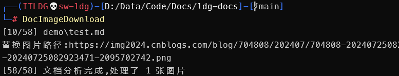

# VuePress 图片下载工具

分析 VuePress 文档中的图片链接并下载,可将图片转码为 Avif 格式,更加节省空间



```powershell
Description:
  分析 VuePress 文档中的图片链接并下载,可将图片转码为 Avif 格式,更加节省空间

Usage:
  DocImageDownload [command] [options]

Options:
  -dd, --doc_dir <doc_dir>  MD文档存放文件夹 [default: src]
  -id, --img_dir <img_dir>  图片存放文件夹 [default: src\.vuepress\public]
  -nc, --no_convert         不转换图片格式为 Avif [default: False]
  --version                 Show version information
  -?, -h, --help            Show help and usage information

Commands:
  install    配置环境变量
  uninstall  移除环境变量
```

## 使用方法

在文档的根目录下运行以下命令

```powershell
DocImageDownload
```

如果您的目录结构不同,请使用 `-dd` 和 `-id` 参数指定文档和图片的目录

```powershell
DocImageDownload -dd src -id src\.vuepress\public
```

如果您不想将图片转码为 Avif 格式,请使用 `-nc` 参数

```powershell
DocImageDownload -nc
```


### 查看帮助

```powershell
DocImageDownload -h
```